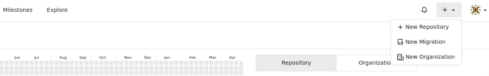
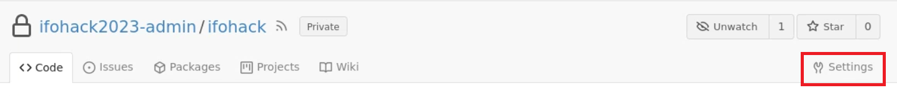
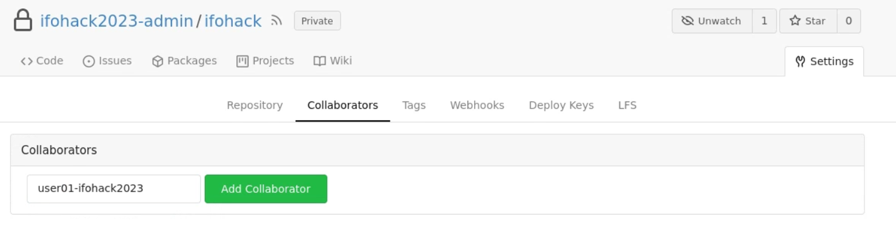
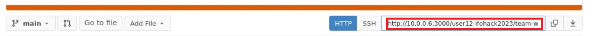

# Workflow for collaboration via Gitea

> **Warning**
> It is important to work in `~/Desktop/project_directory` as only here, a sufficiently large file system is mounted. 

## Overview: 
- 1 team member is the project "owner", the others are contributors.
- All members can have the same rights, just one of them needs to first set up the project.
- The owner creates a repository on Gitea and adds other members as contributors.
- The owner pushes a local project to Gitea and the other members clone this repository.

## 1. Setting up git
open a terminal and execute the following commands: 
- `git config --global user.email user<your-number>-ifohack2023@ifo.de` (replace "<your-number>" with your actual user number. E.g., `user07-ifohack2023@ifo.de`)
- `git config --global user.name user<your-number>-ifohack2023` (replace "<your-number>" with your actual user number. E.g., `user07-ifohack2023`)


## 2. Setting up Gitea
### Login
- open a browser on the VM and visit `http://10.0.0.6:3000`
- click "Sign in" 
- Enter username and password
    - username: `user<your-number>-ifohack2023` (replace "<your-number>" with your actual user number. E.g., `user07-ifohack2023`)
    - password: same as your username on first login. You will be prompted to change it on the next screen

### Project owner: 
#### Create repository
- create a new repository

- You can choose any name you want for your repository
- **Important**: Make sure to check "Make Repository Private", so only you and your team members can access it. 

#### Add collaborators
- go to repository settings

- add collaborators 



## 3. Create local repository

### Copy data into your project directory
- Copy data from `~/Desktop/sourcedata/` to `~/Desktop/project_directory/`
- You can use the `project_directory` as is, or change the folders in it.
- If you want to use the suggested folder structure, copy the files to `~/Desktop/project_directory/input/`

### Owner:
#### Initialize git
- In case you do not know how to enter the directory, execute `cd ~/Desktop/project_directory`
- `git init`

> **Note**
> The default branch name is different from the default branch name on Gitea. 
> To avoid confusion, change it here:
> `git branch -M master main`

#### Connect to remote repository: 
- Copy the URL to your repository 

- in your project directory execute `git remote add origin <url>` (replace "<url>" with the actual url you just copied)


#### Push local project
- see "4. Push local changes" below

### Collaborators: 
- Go to Gitea and copy the url to your project 

- In your local project_directory, execute `git clone <URL>` (replace "<URL>" with the actual url you just copied).
- You should be prompted to enter your previously set up Gitea username and password.

### Exclude original data from version control
- please do not push larger data files to the repository. It should mostly be used for smaller text files such as your code. 
- Thus, create a text file named `.gitignore` in the root of your project directory and add the locations that shall be ignored by git. 
- For example, when you use the provided folders and copied the data to `~/Desktop/project_directory/input/`, the `.gitignore` should look like this: 
```
# .gitignore

env/*
export/*
input/*
temp/*
```

### 4. Push local changes
1. open a terminal in your project directory
2. execute `git add .`  (or explicitly name the files to add)
3. execute `git commit -m "<your commit message>"` (include a helpful commit message about your changes)
4. push the changes to gitea: `git push -u origin <branch-name>` (Replace "<branch-name>" with the name of the branch you work on and you want to push to. E.g. `git push -u origin main`)


