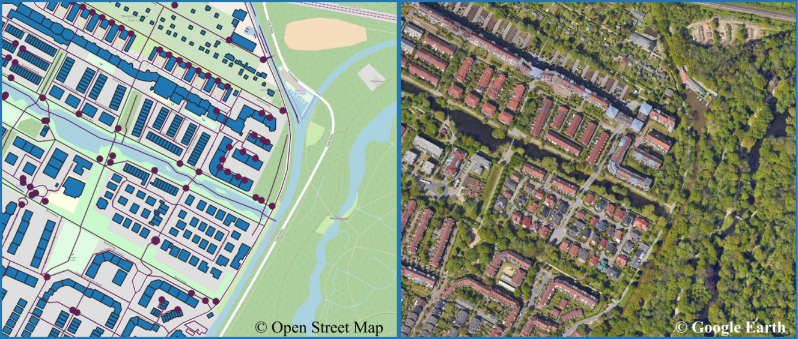

## Land Price Prediction Using Open Spatial Data 

### The challenge

It is estimated that in 2020 45% of Germans lived in owned residences, marking the second lowest share of homeowners of all OECD countries.  At the same time, old-age poverty is predicted to be on the rise in Germany due to increasing housing costs, and will affect particularly vulnerable populations like tenants, homeowners with mortgages, single-person households and people with migration background. Population with migration background or low incomes are also more likely to suffer the consequences of environmental hazards and pollution. At the other end of the spectrum, accumulation of wealth is one of the less well-perceived drivers of inequalities in the country, with one of the most important forms of wealth for most households being wealth in real estate. 

This spatial ifoHack challenge aims to investigate the relationship between land prices and spatial factors that characterize living environments, in large and diverse cities in Germany: *Berlin*, *Bremen*, *Dresden*, *Frankfurt am Main* and *Köln*. By exploring information extracted from relevant spatial datasets, we aim to guide participants into exploring non-conventional data sources, to answer relevant economic questions related to housing markets and spatial inequalities. Are land prices positively associated with a greater availability of spatial determinants of well-being, such as green and open spaces, or walkable and bicycle paths? Is proximity to amenities, educational, leisure or work opportunities a factor that drives higher land prices? Is there a spatial segregation effect in terms of land prices and specific population subgroups? These are only some of the questions we aim to explore together at the ifoHack. 

By getting to know the right spatial data and methods, formulating new ideas that fit your specific research interests will be only one short step away.

Concretely, the challenge can be modeled as a regression where the depedent variable to be estimated is the average land price per neighborhood. This task can be further seen as a 3-part challenge: 1) Visualising and exploring spatial datasets; 2) Generating a set of predictors; 3) Solving a regression problem.

1. The first phase of exploration allows participants to perceive visually differences between neighborhoods with different land prices.
1. The predictors to be computed from the input datasets can be for example:
    - Average population (or building) density in the neighborhood
    - Amount of green space in the neighborhood
    - Number of buildings with special function in the neighborhood (e.g. schools, hospitals, restaurants)
    - Average (or shortest) distance from each residential building to a building with a special function (e.g distance to schools)
    - Total length of walkable paths in the neighborhood
    - Isolation of the senior population (e.g. by computing various segregation indices)
1. Due to the complexities of spatial data processing and time limits, the dependent variable can be chosen as land prices for one city, or for multiple cities. 
 
### Tools
 
**Python** is the main language of the ifoHack.  

1. Data processing and analysis

There are a large number of available Python packages for complex spatial data processing and analysis. [GeoPandas](https://geopandas.org/en/stable/getting_started/introduction.html) is a well-established package that allows interacting with spatial data in similar ways as interacting with simple tabular data, through data frame objects. [OSMnx](https://github.com/gboeing/osmnx) provides a simple and efficient interface for retrieving and analysing Open Street Map data, and is especially useful in processing street networks. Further methods for network analysis are available with [Networkx](https://networkx.org/).For examples of applying segregation methods, see [Segregation](https://github.com/pysal/segregation); for computing measures of city complexity see [momepy](http://docs.momepy.org/en/stable/) and for further exploration of spatio-temporal sociodemographc data, see [PySAL](https://pysal.org/explore/). [Rasterio](https://rasterio.readthedocs.io/en/latest/index.html) is one of the most used packages for processing satellite images. 

We encourage you to explore the packages already installed with the ifoHack environment, and also search and test new methods that could fit the purpose of the challenge, or of your own research.  
 
2. Model building and testing

While no condition is placed on how to build regression models, [scikit-learn](https://scikit-learn.org/stable/index.html) is a good place to start. For tracing all tests and model optimization steps taken, we recommend the use of [MLflow](https://www.mlflow.org/docs/latest/index.html), which integrates nicely with scikit-learn, but which can also be used with other Python packages, and also in your R or Java machine learning projects. Train and test machine learning model examples can be found here [here](https://github.com/mlflow/mlflow/blob/master/examples/sklearn_elasticnet_diabetes/osx/train_diabetes.py).
	
3. Visualisation
 
For plotting interactively results and maps, we provide examples using [Bokeh](https://bokeh.org/). In the notebook tutorials, examples using [folium](https://github.com/python-visualization/folium) are also available. 

### Challenge Setup

We recommend the use of [VSCode](https://code.visualstudio.com/) as Integrated Development Environment (IDE), but other IDE-s can also be used. If VSCode is chosen, we recommend to install the [Python extension](https://code.visualstudio.com/docs/languages/python). If [Sypder](https://www.spyder-ide.org/) is chosen, the spyder-kernels package is already included in the environment for the challenge, but you should update your Spyder standalone install to the latest version (5.4.3).

For managing the Python environment and packages, we use [Conda](https://docs.conda.io/projects/conda/en/latest/index.html), an open-source system.  We assume a version of Conda is installed on participants' notebooks ([Anaconda](https://www.anaconda.com/download) / [Miniconda](https://docs.conda.io/en/latest/miniconda.html) / [Miniforge](https://github.com/conda-forge/miniforge)) and we recommend that all environment creation or package install to be managed through the Conda terminal/prompt (on your notebook, Start > Anaconda/Miniconda/Miniforge > Prompt). A guide on the most important commands can be consulted in the official [doc](https://docs.conda.io/projects/conda/en/latest/user-guide/tasks/manage-environments.html#).

A Conda environment with all required Python packages can be created from the provided yml file via the command `conda env create -f ifohack_spatial_py310_environment.yml`. The command should be run in the Conda prompt after navigating to the folder where the yml file was copied. Activate the environment with `conda activate ifohack_spatial_py310`; deactivate with `conda deactivate`. If for any reason the environment is no longer suitable (e.g. installing new packages which produce errors, breaking package dependencies etc) you can remove it with `conda remove --name ifohack_spatial_py310 --all` and start again with a new environment. This process will not affect your code files. If you wish to save a new version of the environment you can use the command `conda env create -f ifohack_spatial_py310_myversion.yml` while the environment is active, to create a new yml file; make sure to change the first line of the yml file to give the environment a new name, e.g. `name: ifohack_spatial_py310_myversion`.

For visualising, exploring and point-and-click processing of spatial data files, we will use [QGIS](https://qgis.org/en/site/), an open-source GIS tool. Installation requires 2.5GB of disk space, and is consequently not mandatory, but highly recommended. 

For using [Google Earth Engine](https://earthengine.google.com/) and its APIs, you need to create and activate a GEE account, process which might require a few days, and should be done prior to the actual start of the hackaton.

### Challenge Evaluation Criteria

The completion of the challenge will be evaluated by: *(1)* Acuracy of prediction of residential land prices; *(2)* Creation of original variables from processed spatial and sociodemographic data; *(3)* Visualisation of original variables; *(4)* Ability to use MLFlow to generate and test different regression models (as a bonus criteria).  

For the visualisation points, teams should be able to display a map and interesting original variables in either an individual app, or in a dedicated Jupyter notebook. The display can be of any type (points, lines, polygons) and it should have basemap tiles (e.g. Open Street Map tile).

### Tutorials

Examples of the use of the most common Python libraries can be found in the Jupyter [notebooks](notebooks). A short [guide](notebooks/GoogleEarthEngineIntroduction.pdf) into using Google Earth Engine and links to further examples are also provided.

The Python and R geospatial community is both active and driven to publish open data, methods and learning materials. For further information on methods of geospatial anaylsis, participants can consult the following tutorials:
- [Introduction to Python for Geographic Data Analysis](https://pythongis.org/)
- [Geographic Data Science Book](https://geographicdata.science/book/intro.html)	
- [Rasterio Cookbook](https://github.com/mapbox/rasterio-cookbook)   
- [GIS course with Python](https://www.earthdatascience.org/workshops/gis-open-source-python/)

### Authors

Challenge prepared by Oana Garbasevschi ([LinkedIn](https://www.linkedin.com/in/oana-garbasevschi-b92311a7/) [Twitter](https://twitter.com/omgarb)) and Manuel Köberl ([LinkedIn](https://www.linkedin.com/in/manuel-k%C3%B6berl-079bb2259/?originalSubdomain=de) [Xing](https://www.xing.com/profile/Manuel_Koeberl043365)). 

For more interesting research on spatial datasets and their relevance for socioeconomic challenges, you can explore the work of our team at DLR, [City and Society](https://www.researchgate.net/lab/City-and-Society-Hannes-Taubenboeck).