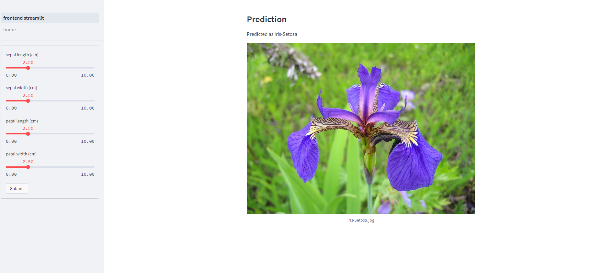

# Final Exercise

In this final exercise, we combine the new concepts and technologies into one use case.
More precisely, we build a classification model for the [Iris plants dataset](https://scikit-learn.org/stable/modules/generated/sklearn.datasets.load_iris.html#sklearn.datasets.load_iris).
This README will guide you through all necessary tasks.

Please solve the task in `/task`.
`/solution` contains a sample solution.

The general idea is a MLFlow backend (serving the model) and a Streamlit frontend (presenting the model).
We use Docker to create a microservice for both of them, and orchestrate them with Docker Compose (a so-called Docker network).
Change into the same directory like the corresponding `compose.yml`.
Now, you can build all Docker containers with `docker compose build`, and start them with `docker compose up -d`.
Simply run `docker compose down` to shut them down.

## Model Endpoint

We start by implementing the model endpoint.
For this task, we focus on `./model_api`.

### Data Preparation and Model Training

Please follow the notebook `./model_api/data_preparation_and_model_training.ipynb` to prepare the data and train a Random Forest classification model.

### Model Deployment

In the last step of the notebook, we build a Docker Image that serves the corresponding model as an API.
For example, we can use the following command (from our host machine) to predict the class of three flowers.

```
curl -X POST -H "Content-Type:application/json" --data '{ "dataframe_split": { "columns":["sepal length (cm)", "sepal width (cm)", "petal length (cm)", "petal width (cm)"], "data":[[5.0, 3.4, 1.5, 0.2], [5.8, 2.7, 5.1, 1.9], [5.6, 2.9, 3.6, 1.3]] }}' http://localhost:8080/invocations
```

It sends a query to our model entpoint, and receives a result like: `{"predictions": [0, 2, 1]}`.

Please note that we can use the container name `iris_model_api` instead of `localhost` inside the Docker network (i.e., inside the Docker Compose file).

## Frontend

Now we build a frontend for our model.
For this task, we focus on `./frontend`.

### Frontend Development

complete the streamlit_frontend.py by following the instructions in the file.

the app should look as follows:


1.  insert sliders for each feature inside the sidebar form on the left side.

2.  return the predicted class on top of the page.

3.  return the image of the corresponding flower class.

### Frontend Deployment

complete the Dockerfile by following the instructions.

You can visit the frontend in your browser via http://localhost:8502/.

## Run the App

Finally, we can build an run our app by running `docker compose build` and `docker compose up -d` from the same directory as the corresponding `compose.yml`.
Visit the frontend endpoint in your web browser, and classify some Iris.
